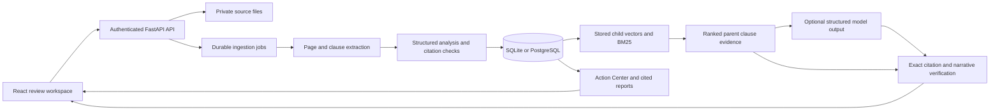

# LegalLens architecture

LegalLens is an evidence-first review MVP. It provides informational document analysis and consultation preparation. It does not determine enforceability, recommend evasion, or supply external legal rules.

## Runtime boundaries

React/TypeScript/Vite calls a same-origin FastAPI API. SQLAlchemy persists ownership and artifacts in PostgreSQL (Compose) or SQLite (development). Uploaded source files use generated storage keys, never client paths. A single API process runs a bounded two-thread processing pool backed by durable SQL jobs. Pending jobs recover at startup. Use exactly one API worker; replica-safe locking and a distributed queue are not implemented.

```
Account -> Workspace -> Document -> immutable DocumentVersion (SHA-256)
                           |-> DocumentPage (text, quality, OCR, blocks)
                           |-> AnalysisRun (durable state and completion)
                           |-> DocumentSection -> Clause -> Citation
                           |-> DocumentChunk (parent ID, offsets, tokens, vectors, cache signature)
                           |-> Entity / Obligation / RiskFinding
Workspace -> ChatSession -> Message
Workspace -> Comparison -> left/right immutable documents
Workspace -> GeneratedReport -> source document IDs and exported file
```

Documents are immutable after upload: a changed file is a new document ID/version snapshot. Unchanged ready analyses reuse persisted results when content hash and analysis/index/embedding signatures match. Reanalysis replaces derived rows for the same immutable bytes and preserves completion plus user-authored actions/notes when occurrence IDs match. A version-family editor is not implemented.



## Controlled workflow

1. Authenticate and verify ownership/workspace scope at every read and write boundary.
2. Bound the HTTP body before multipart parsing; validate size, suffix, declared MIME, file signature and DOCX archive budget.
3. Persist the uploaded file and durable job; return HTTP 202 and job ID.
4. Extract page text, PDF blocks/coordinates, DOCX paragraphs/tables, or TXT form-feed pages. Low-text PDFs attempt Tesseract OCR. Failed/low-confidence OCR remains visible and is excluded from reliable answers.
5. Parse numbered sections/headings and paragraph fallbacks. Retain clause parents and page provenance; search sentence/paragraph children without discarding their parent.
6. Classify clauses and extract explicit obligation sentences, dates, amounts and candidate review patterns. Never manufacture a calendar date from an unanchored relative expression.
7. Verify all stored citations against document, page, section, exact normalized excerpt and coordinates where supplied.
8. For questions, classify prohibited/jurisdiction-sensitive requests, retrieve with BM25 and optional learned embeddings, fuse reciprocal ranks (`k=60`), rerank by concept coverage, and return entire cited clause parents. Unavailable evidence produces explicit abstention.
9. Configured model assistance generates structured plain-language interpretations referencing bounded evidence IDs. The server resolves canonical citations, checks numeric claims and uses a separate model call to review support. These are automated, fallible semantic checks. Unsupported fields are omitted or visibly fall back to local extraction. There are no model tools or autonomous agents at runtime.

The default dense feature projection is deterministic synonym/hashed concept retrieval, not a learned model. Source child text, parent IDs, clause-relative offsets, page/section, terms and local vectors persist in version-bound SQL JSON rows. Hosted embeddings are optional: at most 4,000 children of at most 16,000 characters are embedded during ingestion, in batches of 64. Later questions embed only the query. Indexing failures produce a visible warning and local retrieval; configuration changes require reanalysis before using hosted vectors. Demo workspaces use the configured generation and embedding providers. This is persistent exact vector ranking for small workspaces, not an approximate-nearest-neighbor service.

The Action Center reads stored facts and review findings. Editable `user_action` and `user_notes` are persisted separately from the immutable extracted `action` and citations. Relative deadlines remain expressions with no inferred calendar dates. Authenticated Markdown export includes evidence and labels personal edits; deleting the source cascades to those edits.

## Evidence and legal-safety boundary

Document facts carry exact source evidence. Plain-language wording is explicitly labeled system interpretation. Missing fields remain `Not found`. Review labels indicate attention, not validity. Risk absence checks identify extraction coverage gaps, not proof of absence. Confidence values are heuristic extraction scores, not calibrated probabilities or legal certainty. Model-generated paraphrase entailment is deliberately not claimed: the model verifier accepts only canonical source spans across every narrative field.

General legal information retrieval is disabled. Jurisdiction is user-entered or visible in quoted governing-law evidence; it is never inferred from location. Enabling legal sources later requires jurisdiction-tagged allowlists, authority/source URL and retrieval timestamps, citation validation, and evaluation against a reviewed corpus.

## Privacy, retention, and deployment constraints

Passwords use salted scrypt; random session tokens are stored only as SHA-256 hashes and expire. Cookies are HttpOnly, SameSite Strict; enable Secure behind HTTPS. Origin checks protect browser mutations. Upload content is untrusted and never executed. CSV exports neutralize spreadsheet formula prefixes. API errors and logs exclude source text; access logging is disabled in the documented startup command.

Source and derived content remain until explicit deletion. Deleting a document also purges workspace reports and conversations that may contain its excerpts. Per-workspace mutation locks prevent export/deletion races within the supported single process. Files are removed from active storage; this does not promise forensic erasure or removal from operator backups. Use encrypted disks/volumes and a documented backup retention policy. Provider deletion/retention requires the operator's provider arrangements. Model/embedding configuration sends relevant content to that provider; both are off by default.

The app does not include password reset, email verification, account deletion UI, SSO, malware sandboxing, distributed rate limits, approximate-nearest-neighbor search, or multi-worker processing. Public SaaS operation requires account lifecycle, resource isolation and operational controls beyond this single-process MVP.

## Generative interpretation workflow

`generation.py` owns typed draft schemas, canonical evidence resolution, numeric guards and a second model call checking each interpretation against its sources. `grounded_generation_v1.txt` treats all supplied text as untrusted data and excludes legal-effect conclusions. Ingestion keeps deterministic facts and obligations while enriching summary, meaning and clause explanations. Accepted lawyer questions flow into Action Center and report exports. Q&A uses retrieved evidence; comparison retains exact A/B sources and provides version direction to its support reviewer.

Generated prose is labeled system interpretation. Exact citation existence is deterministic; semantic support is a fallible model check. A failed interpretation cannot be displayed as checked: document analysis omits it and labels any remaining local fields, while unsupported required Q&A/comparison claims reject the response. Generation signature changes invalidate cached local analysis. Partial generation is retryable. No external model key is exposed to the frontend.
